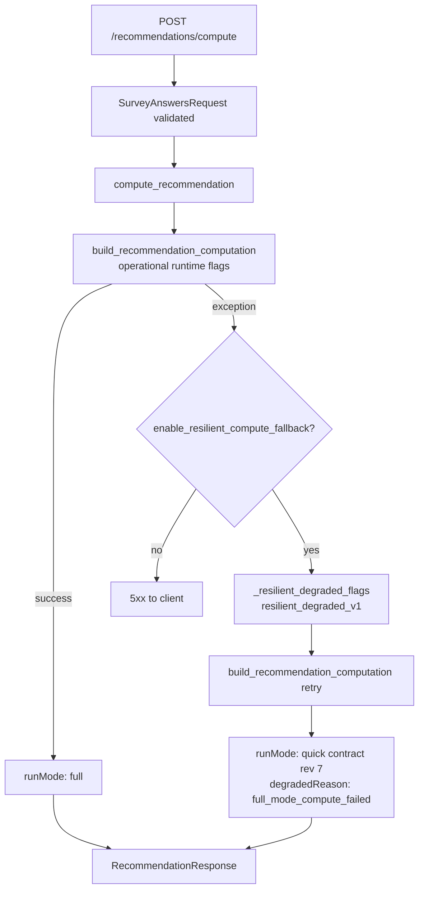

# Architecture Guide

This document explains the recommendation platform at a system level so changes can be made safely.

## System map

- API layer: `src/keyboard_recommender/api/` and `src/keyboard_recommender/api/v1/`
- Application/use-case layer: `src/keyboard_recommender/application/`
- Recommendation engine: `src/keyboard_recommender/trait_engine/`
- Evaluation and drift: `src/keyboard_recommender/recommendation_quality/`
- Persistence and DB session: `src/keyboard_recommender/infrastructure/persistence/`
- Config and feature flags: `src/keyboard_recommender/config/settings.py`

## Recommendation pipeline overview

Request path for `POST /api/v1/recommendations/compute`:

1. FastAPI route validates `SurveyAnswersRequest` (no client `mode`; legacy `mode=quick` → 422).
2. `compute_recommendation()` resolves operational runtime flags.
3. Trait engine computes ranked parts (switch/plate/foam/layout/case/keycap).
4. Build selection applies compatibility, diversity, fallback, and optional feedback learning.
5. API envelope assembles stable response payload with `runMode: "full"` on success.
6. Optional reliability/perf layers run:
   - response cache (TTL, profile-tunable)
   - async evaluation persistence
   - unified analytics event generation

Main files:

- `src/keyboard_recommender/application/recommendation_service.py`
- `src/keyboard_recommender/trait_engine/pipeline.py`
- `src/keyboard_recommender/recommendation_quality/build_selection.py`
- `src/keyboard_recommender/trait_engine/api_envelope.py`

## Recommendation compute paths (happy path vs resilient degraded)

**Product policy:** every user-facing recommendation uses the **FULL** engine. A separate user «quick recommendation» path does not exist.

| Path | When | Runtime flags | Response |
|------|------|---------------|----------|
| **Happy (full)** | Default | Operational flags from drift/automation | `runMode: "full"`, no `degradedReason` |
| **Resilient degraded** | Full compute raises and fallback enabled | `_resilient_degraded_flags()` — rerank/feedback off, `resilient_degraded_v1` | `runMode: "quick"` (internal label), `degradedReason: "full_mode_compute_failed"` |

Frontend shows **«안정 모드로 추천했어요»** when `degradedReason` is set. This is **availability fallback**, not the removed quick-start UI.

Settings: `enable_resilient_compute_fallback` (default `true`). Tests: `tests/test_recommendation_resilient_fallback.py`.

## Evaluation system overview

Purpose: make recommendation quality measurable, comparable, and queryable over time.

- Snapshot build: `evaluation/snapshots.py`
- Metric scoring: `evaluation/scoring.py`, `evaluation/metrics.py`
- Diagnostics narratives: `evaluation/diagnostics.py`
- Comparisons/benchmarks: `evaluation/comparisons.py`, `evaluation/benchmarking.py`
- Storage ingestion: `evaluation/storage/ingestion.py` + repository models
- Unified event ingestion: `evaluation/unified_pipeline/`

Runtime integration:

- Called from `application/evaluation_persistence_hook.py`
- Best-effort design: persistence failures are swallowed and logged; recommendation response still returns

## Drift system overview

Drift detection and operational controls are under `recommendation_quality/`:

- Trend/drift analysis: `evaluation/trend_analysis.py`
- Threshold evaluator: `operational_monitoring/threshold_evaluator.py`
- Runtime resolver: `operational_monitoring/runtime.py`
- Rollback policy: `rollback_controller/controller.py`
- Feature flags: `feature_flags/`
- Alerting: `alerting/notifier.py`

Operational flow:

1. Collect recent confidence/evaluation signals.
2. Evaluate threshold breaches.
3. Derive reversible runtime flags (reranking/fallback/feedback weighting/model tag).
4. Apply flags to recommendation compute path.
5. Emit alert (optional webhook).

## Scaling and compute-cost controls

- Caching:
  - recommendation result cache
  - evaluation-heavy computation cache
- Batch processing:
  - unified events queued and flushed in batches
- Async offloading:
  - heavy diagnostics/evaluation persistence moved off request thread
- Traffic profile presets:
  - `SCALING_PROFILE=low|medium|high|custom`

See `developer-guide.md` for enablement steps and `runbook.md` for incident handling.
