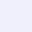

# 다크 모드 색상 인벤토리

Source: 라이트 모드 `LIGHT_MODE_COLOR_INVENTORY.md` 기반 다크 모드 추천 팔레트  
Design: Precision Editorial dark (Manus deep indigo — inverted surfaces, preserved brand)

---

## 설계 원칙

| 원칙 | 내용 |
|------|------|
| **브랜드 컬러 유지** | Primary 인디고는 다크 배경에서 대비를 위해 약간 밝게 조정 (`#6366F1`) |
| **면 반전** | 흰 면 → 깊은 인디고-틴트 다크 (`#12121E`, `#0D0D16`) |
| **텍스트 반전** | 거의-검정 → 거의-흰 (`#F0F0FC`) |
| **액센트 유지** | Emerald(`#10B981`), Gold(`#F59E0B`)는 다크에서도 동일하게 작동 |
| **컨테이너 반전** | 연한 인디고 컨테이너 → 어두운 인디고 컨테이너 |

---

## 핵심 브랜드 & 면

| 스와치 | 라벨 | HEX | RGB | 라이트 대응 |
|--------|------|-----|-----|------------|
|  | Primary | `#6366F1` | `99 102 241` | `#372FA3` (더 밝게 조정) |
|  | Surface | `#12121E` | `18 18 30` | `#FFFFFF` |
|  | Page wash | `#0D0D16` | `13 13 22` | `#F8F8FC` |
|  | Neutral wash | `#161623` | `22 22 35` | `#F8F9FA` |
|  | Card border | `#2D2D48` | `45 45 72` | `#DCDCEE` |
|  | Ink / footer | `#F0F0FC` | `240 240 252` | `#0F0F19` |
|  | Indigo tint | `#1E1B41` | `30 27 65` | `#EEEBFF` |
|  | Emerald | `#10B981` | `16 185 129` | `#10B981` (동일) |
|  | Gold | `#F59E0B` | `245 158 11` | `#F59E0B` (동일) |

---

## 1. 디자인 토큰 (`.dark` 오버라이드)

`globals.css`의 `.dark {}` 블록에 들어갈 space-separated RGB 값.

| Token | HEX | RGB | 역할 | 라이트 대응 HEX |
|-------|-----|-----|------|----------------|
| `--background` / `--ca-background` | `#0D0D16` | `13 13 22` | 페이지 기본 배경 | `#FFFFFF` |
| `--foreground` / `--ca-on-background` / `--ca-on-surface` / `--ca-base` | `#F0F0FC` | `240 240 252` | 기본 본문·제목 텍스트 | `#0F0F19` |
| `--card` / `--ca-surface` / `--ca-surface-bright` / `--ca-surface-container-lowest` | `#12121E` | `18 18 30` | 카드·패널 면 | `#FFFFFF` |
| `--primary` / `--ca-primary` / `--ring` / `--focus-ring` / `--ca-surface-tint` | `#6366F1` | `99 102 241` | 브랜드 프라이머리 (다크 배경 대비 밝힘) | `#372FA3` |
| `--primary-foreground` / `--ca-on-primary` | `#FFFFFF` | `255 255 255` | 프라이머리 위 글자 | `#FFFFFF` (동일) |
| `--ca-primary-container` | `#3730A3` | `55 48 163` | 프라이머리 컨테이너 | `#4F46E5` |
| `--ca-on-primary-container` | `#C7D2FE` | `199 210 254` | 프라이머리 컨테이너 위 글자 | `#EEEBFF` |
| `--ca-inverse-primary` | `#372FA3` | `55 48 163` | 역전 프라이머리 | `#A5B4FC` |
| `--secondary` / `--ca-secondary` / `--ca-viz-gold` | `#F59E0B` | `245 158 11` | 앰버/골드 액센트 | `#F59E0B` (동일) |
| `--secondary-foreground` / `--ca-on-secondary` | `#0F0F19` | `15 15 25` | 세컨더리 위 글자 | `#0F0F19` (동일) |
| `--ca-secondary-container` | `#503200` | `80 50 0` | 세컨더리 컨테이너 | `#FDE68A` |
| `--ca-on-secondary-container` | `#FDE68A` | `253 230 138` | 세컨더리 컨테이너 글자 | `#784600` |
| `--muted` | `#1A1A2E` | `26 26 46` | 뮤트 면 | `#F5F5FC` |
| `--muted-foreground` | `#9494B4` | `148 148 180` | 보조 텍스트 | `#5A5A78` |
| `--border` | `#2D2D48` | `45 45 72` | 기본 보더 | `#DCDCEB` |
| `--ca-surface-dim` / `--ca-surface-variant` | `#1A1A2E` | `26 26 46` | 약간 어두운 표면 | `#EEEEF8` |
| `--ca-surface-container-low` | `#0D0D16` | `13 13 22` | 페이지·섹션 바탕 | `#F8F8FC` |
| `--ca-surface-container` | `#19192A` | `25 25 42` | 컨테이너 면 | `#F3F3FC` |
| `--ca-surface-container-high` | `#23233A` | `35 35 58` | 높은 컨테이너 | `#EBEBFA` |
| `--ca-surface-container-highest` | `#2D2D4A` | `45 45 74` | 가장 높은 컨테이너 | `#E1E1F5` |
| `--ca-on-surface-variant` | `#9494B4` | `148 148 180` | 보조 본문 | `#50506E` |
| `--ca-inverse-surface` | `#E8E8F5` | `232 232 245` | 역전 면 | `#141428` |
| `--ca-inverse-on-surface` | `#141428` | `20 20 40` | 역전 면 위 글자 | `#F5F5FF` |
| `--ca-outline` | `#505078` | `80 80 120` | 아웃라인 | `#8C8CAA` |
| `--ca-outline-variant` | `#2D2D48` | `45 45 72` | 약한 아웃라인 | `#D2D2E6` |
| `--ca-tertiary` / `--ca-viz-emerald` | `#10B981` | `16 185 129` | 에메랄드(성공/비주얼) | `#10B981` (동일) |
| `--ca-on-tertiary` | `#FFFFFF` | `255 255 255` | 터셔리 위 글자 | `#FFFFFF` (동일) |
| `--ca-tertiary-container` | `#003C28` | `0 60 40` | 터셔리 컨테이너 | `#A7F3D0` |
| `--ca-on-tertiary-container` | `#A7F3D0` | `167 243 208` | 터셔리 컨테이너 글자 | `#005032` |
| `--ca-error` | `#F87171` | `248 113 113` | 에러 | `#DC2626` |
| `--ca-on-error` | `#FFFFFF` | `255 255 255` | 에러 면 위 글자 | `#FFFFFF` (동일) |
| `--ca-error-container` | `#3C0F0F` | `60 15 15` | 에러 컨테이너 | `#FEE2E2` |
| `--ca-on-error-container` | `#FCA5A5` | `252 165 165` | 에러 컨테이너 글자 | `#991B1B` |
| `--ca-ghost-border` (+ opacity 0.15) | `#F0F0FC` | `240 240 252 @ 15%` | 고스트 보더 | `#0F0F19 @ 10%` |
| `--ca-glass-fill` (+ opacity 0.85) | `#12121E` | `18 18 30 @ 85%` | 글래스 패널 채움 | `#FFFFFF @ 92%` |
| `--ca-input-fill` | `#19192A` | `25 25 42` | 인풋 배경 | `#FFFFFF` |

---

## 2. 하드코딩 다크 색 (클래스 리터럴 대응)

라이트의 `bg-[rgb(...)]` 하드코딩 값에 대응하는 다크 추천 값.

| 라이트 HEX | 다크 HEX | 다크 RGB | 역할 | 적용 위치 |
|-----------|---------|---------|------|-----------|
| `#F8F8FC` | `#0D0D16` | `13 13 22` | 페이지/셸 바탕 | auth / mypage / results / shell 배경 |
| `#F8F9FA` | `#161623` | `22 22 35` | 중립 섹션 바탕 | 홈 섹션 / catalog / survey shell |
| `#FFFFFF` | `#12121E` | `18 18 30` | 카드·헤더·면 | 헤더 / 인증 카드 / 카탈로그·결과·마이페이지 카드 |
| `#DCDCEE` | `#2D2D48` | `45 45 72` | 카드·구분 보더 | 카드 테두리 / 구분선 |
| `#EEEBFF` | `#1E1B41` | `30 27 65` | 연한 인디고 칩/콜아웃 | results evidence / overview 칩 |
| `#EEF2FF` | `#1A1836` | `26 24 54` | 히어로 인디고 워시 | home hero 그라디언트 |
| `#0F0F19` | `#F0F0FC` | `240 240 252` | 푸터 텍스트 | site-footer 글자색 |
| `#646478` | `#9494B4` | `148 148 180` | 섹션 라벨(대문자) | 섹션 헤더 라벨 |
| `#828296` | `#6E6E96` | `110 110 150` | 캡션/메타 | 작은 설명 텍스트 |
| `#505064` | `#9494B4` | `148 148 180` | 보조 본문 | 설명문·캡션 |
| `#3C3C50` | `#C8C8E8` | `200 200 232` | 표·리스트 라벨 | 테이블 라벨·제목 |
| `#94A3B8`/`#64748B`/`#475569` | `#64748B`/`#94A3B8`/`#CBD5E1` | — | 레이아웃 다이어그램 스트로크 | `layout-diagram.tsx` — LOCK 대상 |

---

## 3. Tailwind 시맨틱 → 다크 HEX

| 유틸 | 다크 HEX | 라이트 HEX | 용도 |
|------|---------|------------|------|
| `bg-primary` / `text-primary` | `#6366F1` (`99 102 241`) | `#372FA3` | 버튼·링크·액센트 |
| `bg-background` / `text-foreground` | `#0D0D16` / `#F0F0FC` | `#FFFFFF` / `#0F0F19` | 페이지·본문 |
| `bg-muted` / `text-muted-foreground` | `#1A1A2E` / `#9494B4` | `#F5F5FC` / `#5A5A78` | 비활성·보조 |
| `border-border` | `#2D2D48` | `#DCDCEB` | 기본 테두리 |
| `bg-card` | `#12121E` | `#FFFFFF` | 카드 |
| `text-destructive` | `#F87171` | `#DC2626` | 폼 에러 |
| `ca-viz-emerald` | `#10B981` | `#10B981` | 성공·체크 (동일) |
| `ca-viz-gold` | `#F59E0B` | `#F59E0B` | 골드 강조 (동일) |

---

## 그림자·글로우 (다크)

| Token | 값 |
|-------|-----|
| `--ca-elevated-shadow` | `0 1px 3px rgb(0 0 0 / 0.4), 0 8px 24px rgb(99 102 241 / 0.15)` |
| `--ca-btn-glow` | `0 8px 24px rgb(99 102 241 / 0.4)` |
| `--ca-focus-glow` | `0 0 0 3px rgb(99 102 241 / 0.35)` |

---

## globals.css `.dark {}` 블록 예시

```css
.dark {
  --background: 13 13 22;
  --foreground: 240 240 252;
  --card: 18 18 30;
  --card-foreground: 240 240 252;
  --primary: 99 102 241;
  --primary-foreground: 255 255 255;
  --secondary: 245 158 11;
  --secondary-foreground: 15 15 25;
  --muted: 26 26 46;
  --muted-foreground: 148 148 180;
  --border: 45 45 72;
  --ring: 99 102 241;
  --ca-background: 13 13 22;
  --ca-on-background: 240 240 252;
  --ca-surface: 18 18 30;
  --ca-surface-bright: 25 25 42;
  --ca-surface-dim: 26 26 46;
  --ca-surface-variant: 26 26 46;
  --ca-surface-container-lowest: 13 13 22;
  --ca-surface-container-low: 13 13 22;
  --ca-surface-container: 25 25 42;
  --ca-surface-container-high: 35 35 58;
  --ca-surface-container-highest: 45 45 74;
  --ca-on-surface: 240 240 252;
  --ca-on-surface-variant: 148 148 180;
  --ca-outline: 80 80 120;
  --ca-outline-variant: 45 45 72;
  --ca-primary: 99 102 241;
  --ca-on-primary: 255 255 255;
  --ca-primary-container: 55 48 163;
  --ca-on-primary-container: 199 210 254;
  --ca-inverse-primary: 55 48 163;
  --ca-secondary: 245 158 11;
  --ca-on-secondary: 15 15 25;
  --ca-secondary-container: 80 50 0;
  --ca-on-secondary-container: 253 230 138;
  --ca-tertiary: 16 185 129;
  --ca-viz-emerald: 16 185 129;
  --ca-on-tertiary: 255 255 255;
  --ca-tertiary-container: 0 60 40;
  --ca-on-tertiary-container: 167 243 208;
  --ca-error: 248 113 113;
  --ca-on-error: 255 255 255;
  --ca-error-container: 60 15 15;
  --ca-on-error-container: 252 165 165;
  --ca-inverse-surface: 232 232 245;
  --ca-inverse-on-surface: 20 20 40;
  --ca-surface-tint: 99 102 241;
  --ca-viz-gold: 245 158 11;
  --ca-base: 240 240 252;
  --ca-input-fill: 25 25 42;
  --ca-glass-fill: 18 18 30;
  --ca-ghost-border: 240 240 252;
  --ca-elevated-shadow: 0 1px 3px rgb(0 0 0 / 0.4), 0 8px 24px rgb(99 102 241 / 0.15);
  --ca-btn-glow: 0 8px 24px rgb(99 102 241 / 0.4);
  --ca-focus-glow: 0 0 0 3px rgb(99 102 241 / 0.35);
}
```

---

## 참고

- `layout-diagram.tsx`의 slate 계열 스트로크(`#94A3B8`, `#64748B`, `#475569`)는 다크에서도 기하학적 도면 요소이므로 **LOCK** — 변경하지 않음
- `bg-white` → `bg-[rgb(18_18_30)]`, `text-white` → `text-[rgb(240_240_252)]`로 교체
- Tailwind `indigo-50`, `amber-*`, `emerald-*`, `red-*` 계열은 각각 다크 버전 (`indigo-900`, `amber-900`, `emerald-900`, `red-900`)으로 대응

